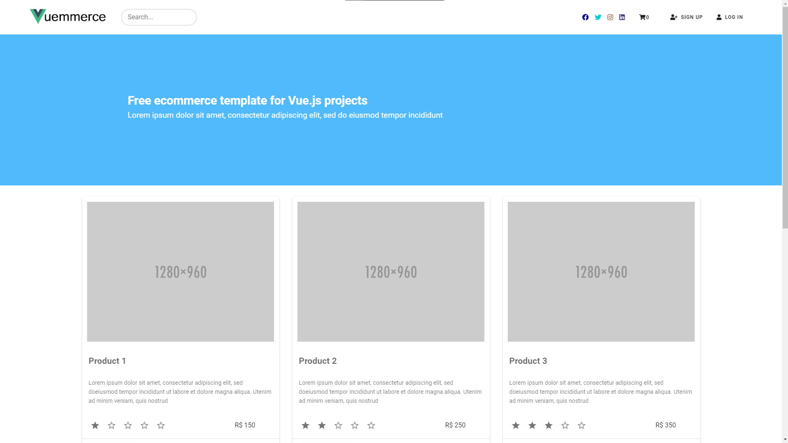
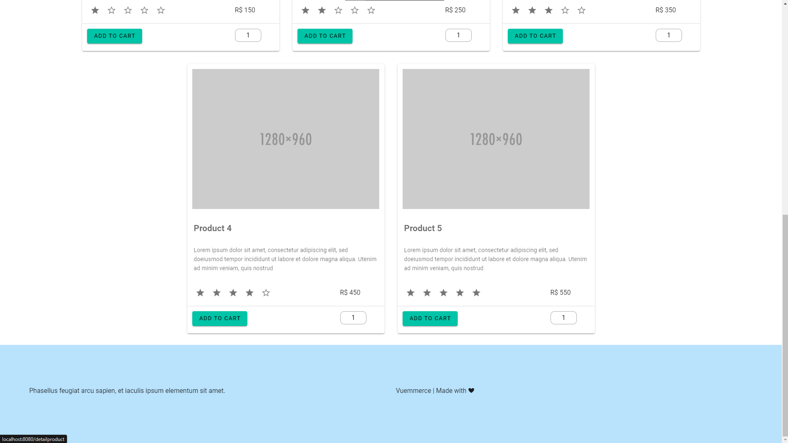

# Vuecommerce-V2.0

A aplicação desenvolvida é um e-commerce, a inspiração foi um e-commerce real.

# Recursos

* O aplicativo foi desenvolvido com JavaScrip, TypeScript, CSS, HTML, BootStrap, SCSS, Vuex, Vue Router e Vue 2.

# Uso

1. Clone o repositório do GitHub.
2. Abra o projeto no seu editor de código.
3. Instale o pacote do projeto com npm install.
3. Starte o projeto com npm run serve.

# Créditos

Este projeto foi criado por Alaska Websites.